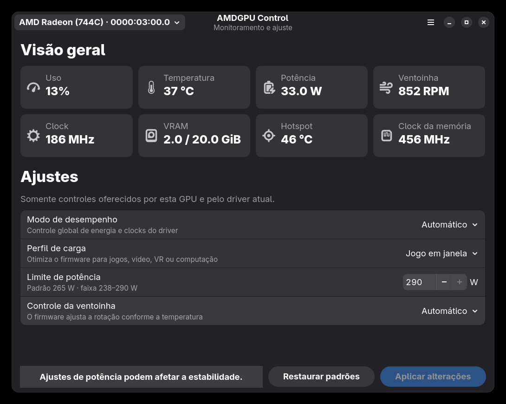
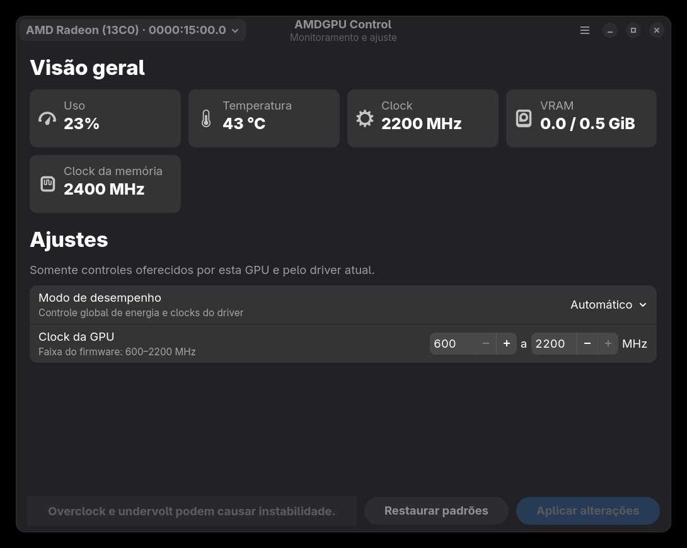

# AMDGPU Control

Aplicativo nativo para GNOME, escrito integralmente em Rust com GTK4 e
libadwaita, para monitorar e ajustar GPUs AMD que usam o driver `amdgpu`.

## Recursos

- telemetria de uso, VRAM, temperaturas, potência, ventoinha e clocks;
- modos de desempenho automático, economia, alto e manual;
- perfis de carga do firmware para jogos, economia, vídeo, VR e computação;
- limite de potência em watts dentro da faixa publicada pelo firmware;
- controle automático ou PWM manual da ventoinha;
- clocks mínimo/máximo, VRAM e offset de voltagem quando o OverDrive existe;
- seleção de múltiplas GPUs AMD;
- aplicação transacional com restauração do estado anterior em caso de falha;
- helper Rust estritamente limitado, protegido pelo Polkit;
- tray nativo via StatusNotifierItem com controles de desempenho e carga;
- inicialização automática e restauração dos ajustes por endereço PCI.

A interface é orientada às capacidades. Um ajuste só aparece quando o kernel,
o firmware e a GPU realmente oferecem o arquivo correspondente em
`/sys/class/drm/card*/device` ou no respectivo `hwmon`. Não são mostradas opções
inoperantes para curva de ventoinha, Zero RPM, clock ou tensão.

## Capturas

### GPU dedicada

A interface apresenta a telemetria e somente os controles realmente expostos
pelo hardware dedicado.



### GPU integrada

Na GPU integrada, os controles indisponíveis são removidos automaticamente.



## Comportamento em segundo plano

`amdgpu-control --background` inicia o StatusNotifierItem sem abrir a janela.
Fechar a janela mantém o tray ativo. Não existe polling periódico enquanto a
janela está fechada ou sem foco; nesse estado o processo aguarda apenas eventos
do desktop. A telemetria é lida a cada dois segundos somente enquanto a janela
está ativa.

O kernel restaura os controles após reiniciar. Quando **Iniciar com o sistema**
está habilitado, o aplicativo inicia em segundo plano e reaplica as opções
salvas para cada GPU. O formato de configuração da versão Python 1.x é lido
diretamente pela versão Rust 2.x.

## Compilar no Fedora

```bash
sudo dnf install cargo rust gcc gtk4-devel libadwaita-devel \
  desktop-file-utils appstream
make test
make build
```

As dependências Cargo estão em `vendor/`, portanto a compilação pode ser feita
offline depois que as dependências nativas forem instaladas.

## Gerar e instalar o RPM

```bash
sudo dnf install rpm-build cargo rust gcc gtk4-devel libadwaita-devel \
  desktop-file-utils appstream
./scripts/build-rpm.sh
sudo dnf install ./dist/rpm/x86_64/amdgpu-control-2.0.0-1.fc*.x86_64.rpm
```

O GNOME usa a extensão AppIndicator/KStatusNotifierItem para exibir o ícone.
Ela é dependência do RPM. Se ainda não estiver ativa:

```bash
gnome-extensions enable appindicatorsupport@rgcjonas.gmail.com
```

## OverDrive e voltagem

Esses ajustes só aparecem quando o driver publica `pp_od_clk_voltage`. Algumas
GPUs e versões do kernel não oferecem essa interface. Não altere
`ppfeaturemask` sem conhecer os riscos: clocks e tensões inadequados podem
causar travamentos, corrupção de dados ou impedir a inicialização da sessão.

Licença: GPL-3.0-or-later.
